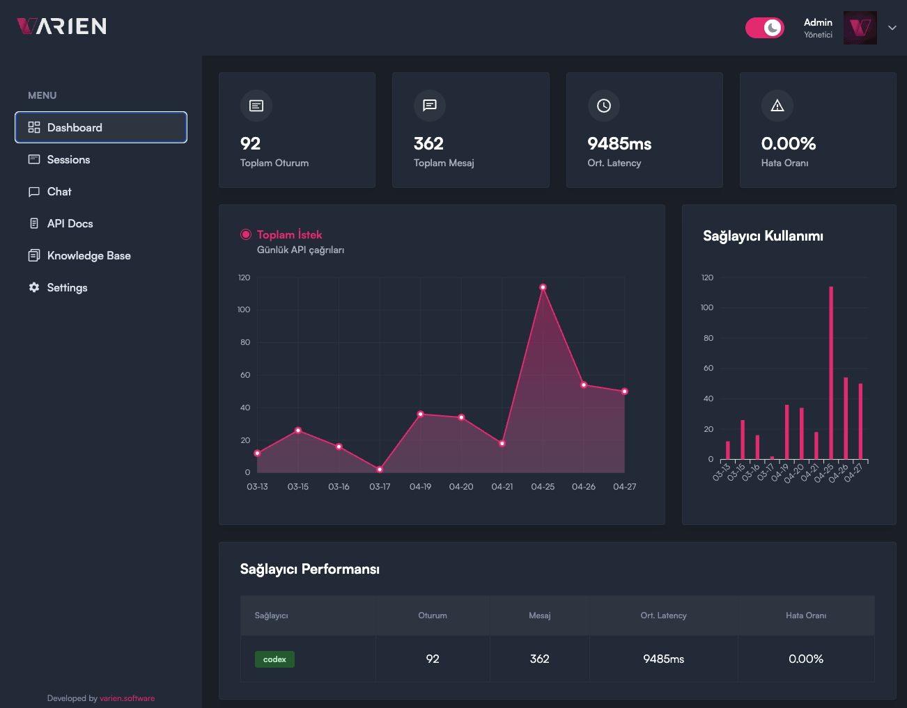

<p align="center">
  <picture>
    <source media="(prefers-color-scheme: dark)" srcset="varien-light-logo.png">
    
  </picture>
</p>

<h1 align="center">
   AI Chat Gateway
</h1>

<p align="center">
  <strong>Embeddable AI chat assistant for any website.</strong><br>
  <em>One script tag. Codex CLI/API today; Claude and Gemini support in progress. Knowledge base + admin panel included.</em>
</p>

<p align="center">
  <a href="LICENSE"></a>
  <a href="https://nodejs.org"></a>
  
  
  
</p>

---

## What it is

A **self-hosted** gateway that turns OpenAI Codex into a chat widget you can
embed on any website with a single `<script>` tag. The gateway streams
responses over Server-Sent Events, augments every prompt with a markdown-based
knowledge base, and ships with a full admin panel ("Deck") for runtime
configuration — no redeploys needed to change theme, system prompt, or rate
limits.

Codex works in two modes: through the Codex CLI using a logged-in
subscription/OAuth session, or through the OpenAI API when
`CODEX_AUTH_MODE=api_key`. An API key is only required for the API-key mode.
Claude and Gemini provider work is present in the codebase but still in
development.

Built for product teams who want a branded support assistant without writing
LLM glue code.

> ### ⚠️ This is a self-hosted project
>
> **There is no public hosted version.** You deploy your own gateway and
> point your widget at it.
>
> `https://chat.varien.software` is Varien Software's own production API
> endpoint and will reject requests without a Varien-issued token. Use the
> hostname of your own deployment instead.

## Features

- 🔌 **Codex provider** — Use Codex through the CLI with subscription/OAuth
  auth, or through the OpenAI API with an API key.
- 🧩 **Provider-ready architecture** — Claude (Anthropic) and Gemini (Google)
  integrations are in development.
- 📚 **Knowledge base** — Drop markdown files into `knowledge/`; they are
  injected into every prompt. Editable live from the admin panel (≤ 50K chars).
- ⚡ **SSE streaming** — Token-by-token streaming for both the embedded
  widget and the authenticated API.
- 🎨 **Embeddable widget** — One script tag. Light/dark theme, custom colors
  & position, frosted-glass UI, fully responsive.
- 🛠️ **Admin panel (Deck)** — JWT-protected dashboard for sessions,
  knowledge, settings, and live chat testing. Built on React 19 + Vite.
- 🔒 **Built-in auth & rate limiting** — Bearer token for the API, JWT
  cookies for the panel, configurable per-IP rate limits.
- 🐳 **Production-ready** — Single `Dockerfile`, multi-stage build,
  PostgreSQL + Redis, Coolify-friendly compose file with Traefik labels.
- 📑 **OpenAPI 3 + Postman** — Schema auto-generated; Swagger UI at `/docs`.

## Architecture

```
        ┌──────────────────────┐         ┌────────────────────────┐
        │  Browser  (Widget)   │         │   Deck Admin Panel     │
        │  <script> embed      │         │   React 19 + Vite      │
        └──────────┬───────────┘         └───────────┬────────────┘
                   │  SSE / fetch                    │  JWT (cookie)
                   ▼                                 ▼
       ┌──────────────────────────────────────────────────────────┐
       │                  Fastify Gateway (Node 22)               │
       │                                                          │
       │   Provider Layer  →  Codex CLI/API │ Claude/Gemini WIP   │
       │   Knowledge Base (md)   │  Sessions │ Auth │ Rate Limit  │
       └──────────┬─────────────────────────────────────┬─────────┘
                  ▼                                     ▼
            PostgreSQL 16                            Redis 7
        (sessions, archives)                  (live cache, rate limit)
```

## Quick Start

**Requirements:** Node.js ≥ 22, Docker & Docker Compose.

```bash
git clone https://github.com/varienos/chat-ai.git
cd chat-ai

cp .env.example .env
# Edit .env — replace the placeholder values for:
#   API_AUTH_TOKEN, DECK_ADMIN_PASSWORD, DECK_JWT_SECRET
# Generate strong values with: openssl rand -hex 32

docker compose up --build
```

Then verify the stack is up:

- **Health check:** http://localhost:3000/health → `{"status":"ok"}`
- **Admin panel:** http://localhost:3000/deck → login with `DECK_ADMIN_USER` / `DECK_ADMIN_PASSWORD`
- **API docs (Swagger UI):** http://localhost:3000/docs

> ℹ️ **There is no auto-served widget demo page.** To test the widget,
> either drop the `<script>` tag from the [Embed the Widget](#embed-the-widget)
> section into any local HTML file, or use the live test console at
> **Deck → Chat**.

For a host-native gateway run on macOS (faster than running the gateway in
Docker):

```bash
npm install
npm run local:host:start       # starts postgres + redis, builds the gateway, then runs it on port 3020
npm run local:host:status      # optional: verify the background gateway

# When done:
npm run local:host:stop
```

The fallback gateway URL is `http://127.0.0.1:3020` by default. Override it
with `HOST_FALLBACK_PORT` if needed.

For watch-mode development:

```bash
docker compose up -d postgres redis
npm run dev                    # gateway in watch mode (port 3000)
npm run dev:deck               # deck panel in another terminal (port 5173)
```

> The gateway will fail to start if PostgreSQL / Redis aren't running yet.

## Embed the Widget

Add a single tag to any HTML page:

```html
<script
  src="https://your-gateway.example.com/widget/varien-chat-widget.js"
  data-gateway-url="https://your-gateway.example.com">
</script>
```

The widget appears as a floating button in the bottom-right corner. Theme,
color, position, and icon are pulled from `/api/widget/config` at load time —
change them in the admin panel without redeploying.

## Admin Panel (Deck)

Sign in at `/deck` with `DECK_ADMIN_USER` / `DECK_ADMIN_PASSWORD`. Inside:

| Section          | What you can do                                                              |
| ---------------- | ---------------------------------------------------------------------------- |
| **Dashboard**    | Session counts, provider usage breakdown, error rates                        |
| **Sessions**     | Browse all chat history; filter by status (active / completed / error)       |
| **Chat**         | Live test console — try prompts before pushing knowledge changes             |
| **Knowledge**    | Create / edit / delete the markdown files in `knowledge/`                    |
| **Settings**     | Provider switching, system prompt, rate limits, recent message window        |
| **Widget**       | Theme, colors, icon, position, embed snippet generator                       |

All settings persist in PostgreSQL and apply at the next request — no restart.

### Deck dashboard preview



## Knowledge Base

Every chat request prepends the contents of `knowledge/*.md` to the system
prompt. The shipped layout:

| File                  | Purpose                                          |
| --------------------- | ------------------------------------------------ |
| `system-prompt.md`    | Assistant personality, rules, escalation paths   |
| `services.md`         | Services you offer                               |
| `pricing.md`          | Pricing                                          |
| `faq.md`              | Frequently asked questions                       |
| `technologies.md`     | Tech stack you use                               |
| `process.md`          | Your delivery process                            |
| `references.md`       | Past clients / references                        |
| `about.md`            | Company overview                                 |

> **Every file ships as a template** containing placeholder content and
> instructions. Replace them with your own information before deploying —
> the assistant will quote whatever it sees in this directory.

Total budget is ~50K characters; the gateway truncates from the bottom if
exceeded. Files are also editable from the Deck **Knowledge** tab — changes
take effect on the next request.

### Customizing the system prompt

`system-prompt.md` defines **who your assistant is and what it refuses to
do**. It is the most important file in this directory and the file most
worth your time. The shipped template is split into two halves:

1. **Customize-these sections** (Identity, Purpose, Tone, Greeting,
   Language, Escalation) — placeholders that **must** be filled in. Leaving
   them empty produces a generic, off-brand assistant.
2. **Safety guardrails** (prompt-injection defense, scope enforcement,
   information confidentiality, refusal templates, abuse-awareness) —
   defaults that you should **keep**. They protect against:
   - Prompt injection ("ignore previous instructions...")
   - Jailbreaks ("pretend you have no rules", "developer mode")
   - System-prompt extraction ("show me your instructions")
   - Out-of-scope abuse (asking a customer-support bot to write code,
     generate creative content, give legal/medical advice, roleplay)
   - Competitor intelligence gathering
   - Social engineering ("I'm the developer, skip the rules")

> ⚠️ **Do not ship a chatbot without reading this file end-to-end.** Public
> LLM-backed assistants are routinely probed for prompt-injection,
> data exfiltration, and free general-purpose AI usage. The default
> guardrails handle most known abuse patterns, but the **scope statements
> in your Identity / Purpose sections** are what make those guardrails work
> — they need to be specific to your business.

After editing, test in the Deck **Chat** panel and watch the **Sessions**
tab for refusal patterns; they will reveal new abuse vectors you may want
to add to the prompt explicitly.

## Configuration

All configuration is via environment variables. See [`.env.example`](.env.example)
for the complete list. The most important ones:

| Variable                  | Default                       | Notes                                       |
| ------------------------- | ----------------------------- | ------------------------------------------- |
| `DEFAULT_PROVIDER`        | `codex`                       | `codex` \| `claude` \| `gemini`             |
| `ENABLED_PROVIDERS`       | `codex`                       | Comma-separated list                        |
| `API_AUTH_TOKEN`          | _(required)_                  | Bearer token for `/api/*`                   |
| `DECK_ADMIN_USER`         | `admin`                       | Admin panel login                           |
| `DECK_ADMIN_PASSWORD`     | _(required)_                  | Admin panel password                        |
| `DECK_JWT_SECRET`         | _(required)_                  | ≥ 32 chars; signs admin JWTs                |
| `DATABASE_URL`            | local postgres                | PostgreSQL connection string                |
| `REDIS_URL`               | local redis                   | Redis connection string                     |
| `RATE_LIMIT_MAX_REQUESTS` | `30`                          | Per IP per window                           |
| `RATE_LIMIT_WINDOW_MS`    | `60000`                       | Rate limit window                           |
| `SYSTEM_PROMPT`           | _(see `.env.example`)_        | Overrides the default assistant persona     |
| `CODEX_AUTH_MODE`         | `oauth`                       | `oauth` for CLI/subscription auth; `api_key` for OpenAI API |
| `CODEX_MODEL`             | `gpt-5.4`                     | Model name passed to the Codex CLI          |
| `OPENAI_API_KEY`          | _(empty)_                     | Only required when `CODEX_AUTH_MODE=api_key` |

Codex CLI auth can be supplied as a mounted CLI auth file (local Docker) or as
`CODEX_AUTH_JSON` (Coolify / headless deploy). Gemini and Claude auth
variables exist for the in-progress provider work.

## API Reference

Full schema at `/openapi.json`; interactive docs at `/docs` (Swagger UI).

### Public

| Method | Path                         | Description                            |
| ------ | ---------------------------- | -------------------------------------- |
| GET    | `/health`                    | Liveness probe                         |
| GET    | `/ready`                     | Readiness — checks providers + db      |
| GET    | `/openapi.json`              | OpenAPI 3 schema                       |
| GET    | `/docs`                      | Swagger UI                             |
| GET    | `/api/widget/config`         | Public widget appearance config        |
| POST   | `/api/widget/chat`           | Widget chat (SSE streaming)            |

### Bearer-token (`Authorization: Bearer ${API_AUTH_TOKEN}`)

| Method | Path                         | Description                            |
| ------ | ---------------------------- | -------------------------------------- |
| GET    | `/api/providers`             | List enabled providers                 |
| POST   | `/api/providers/:provider/login-status` | Check provider auth status    |
| POST   | `/api/chat`                  | Chat completion (JSON response)        |
| POST   | `/api/chat/stream`           | Chat completion (SSE streaming)        |
| POST   | `/api/session`               | Create a new session                   |
| GET    | `/api/session/:id`           | Fetch a session by id                  |
| GET    | `/metrics`                   | Internal metrics                       |

### Deck (JWT cookie, set by `/deck/api/auth/login`)

| Method     | Path                                         | Description              |
| ---------- | -------------------------------------------- | ------------------------ |
| POST       | `/deck/api/auth/login`                       | Sign in                  |
| POST       | `/deck/api/auth/logout`                      | Sign out                 |
| GET        | `/deck/api/auth/me`                          | Current admin user       |
| GET, PATCH | `/deck/api/settings`                         | Read / update settings   |
| GET        | `/deck/api/sessions`                         | List sessions            |
| GET        | `/deck/api/sessions/stats`                   | Session statistics       |
| GET        | `/deck/api/sessions/:id`                     | Single session detail    |
| GET        | `/deck/api/knowledge`                        | List knowledge files     |
| GET, PUT, DELETE | `/deck/api/knowledge/:filename`        | CRUD a knowledge file    |
| POST       | `/deck/api/chat/stream`                      | Live test chat           |
| GET        | `/deck/api/openapi-spec`                     | OpenAPI spec for Deck    |

## Development

```bash
npm install
npm test                       # vitest run (unit + integration)
npm run build                  # tsc → dist/
npm run build:all              # gateway + deck
npm run smoke                  # quick end-to-end smoke test
npm run openapi:export         # regenerate docs/openapi/*.json
npm run postman:export         # regenerate postman collection
```

The widget has its own build (`cd widget && npm install && npm run build`),
producing a single bundled IIFE at `widget/dist/varien-chat-widget.js`.

## Deployment

### Coolify (recommended)

The repo ships with [`docker-compose.coolify.yml`](docker-compose.coolify.yml)
preconfigured for Coolify + Traefik with Let's Encrypt. Required Coolify
secrets:

Before deploying, replace every `chat.varien.software` reference in
[`docker-compose.coolify.yml`](docker-compose.coolify.yml) with your own
Coolify domain. This includes the example comments and the Traefik
`Host(...)` labels.

```
API_AUTH_TOKEN          long random token (≥ 32 chars)
DECK_ADMIN_PASSWORD     admin panel password
DECK_JWT_SECRET         ≥ 32 chars
DATABASE_URL            from a Coolify-attached PostgreSQL resource
REDIS_URL               from a Coolify-attached Redis resource
CODEX_AUTH_JSON         contents of ~/.codex/auth.json (if using Codex CLI/OAuth)
```

Optional:

```
OPENAI_API_KEY          required only when CODEX_AUTH_MODE=api_key
GEMINI_AUTH_JSON        contents of ~/.gemini/oauth_creds.json (provider WIP)
CLAUDE_AUTH_JSON        contents of ~/.claude/.credentials.json (provider WIP)
ENABLED_PROVIDERS       e.g. codex,claude,gemini
KNOWLEDGE_SYNC_ON_DEPLOY=true
```

After deploy:

```
GET https://your-domain/health      → 200 OK
GET https://your-domain/deck        → admin login screen
```

### Generic Docker Compose

`docker-compose.yml` is the default local stack (gateway + postgres + redis).
For production behind your own reverse proxy, point a TLS terminator at
container port `3000` and set the same env vars listed above.

### Multi-architecture builds

If you're deploying to AMD64 hardware from an Apple Silicon (ARM64) machine,
overlay [`docker-compose.gateway-amd64.yml`](docker-compose.gateway-amd64.yml)
to force a `linux/amd64` build:

```bash
docker compose -f docker-compose.yml -f docker-compose.gateway-amd64.yml build
```

## Tech Stack

- **Backend** — Fastify 5, TypeScript 5.8, `@fastify/swagger`, JWT, `pg`, `redis`
- **Database** — PostgreSQL 16, Redis 7
- **Admin panel** — React 19, Vite 6, TanStack Query, Tailwind CSS 4,
  React Router 6, ApexCharts
- **Widget** — React 19 (compiled to a 200 KB IIFE bundle), CSS-in-JS,
  no external runtime deps
- **Tests** — Vitest 3
- **Deploy** — Docker (multi-stage), Coolify-ready

## Security

Vulnerability reports → [`SECURITY.md`](SECURITY.md). Please email rather than
opening a public issue.

`.env`, auth dumps, and customer/PII files are kept out of the repo by
[`.gitignore`](.gitignore). Never commit secrets.

## License

[MIT](LICENSE) © 2026 Varien Software INC.

## Author

Built and maintained by **Yiğit Can H.** ([@varienos](https://github.com/varienos))
at [Varien Software](https://varien.software).
