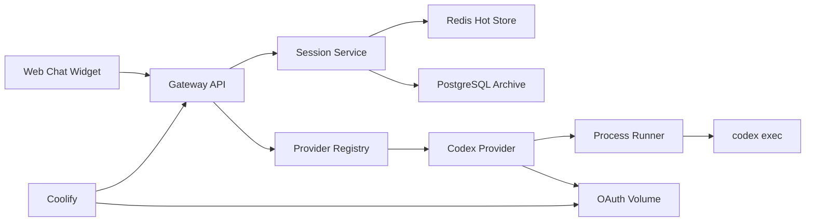

# Codex-First CLI Gateway Design

**Date:** 2026-03-12
**Status:** Approved for implementation planning
**Scope:** Phase 1 Codex MVP, with clean extension points for Gemini and Claude

## Problem Statement

We need a Dockerized AI gateway that exposes CLI-based LLM tools as an HTTP API for a simple website chatbot. The first release must work with Codex CLI only, authenticate through OAuth, support synchronous and streamed chat responses, and run cleanly on Coolify after a git push deployment.

The chatbot use case is narrow on purpose:

- end users ask questions about building a mobile app
- the system should answer, not act as a coding agent
- tool usage and unsafe agentic execution must stay disabled by default
- any web UI, chat widget, or admin interface is an external client of this API and not part of this repository scope

## Goals

- Ship a working Codex-first MVP quickly.
- Keep the API provider-agnostic so Gemini and Claude can be added later without route churn.
- Preserve OAuth login state across container restarts and redeploys.
- Support session-based chat over HTTP and SSE.
- Store live session state separately from long-term transcripts for analysis.
- Fit naturally into a Coolify git-based deployment workflow.

## Non-Goals

- Multi-workspace execution in Phase 1.
- Public admin UI for transcript browsing in Phase 1.
- Any frontend, chat widget, or admin interface implementation in this repository.
- Agentic file editing, shell automation, or low-approval execution in the public chatbot path.
- Multi-tenant auth brokering in Phase 1.

## Key Decisions

1. **Codex-first and OAuth-only**
   - Phase 1 uses Codex CLI only.
   - Authentication is handled with `codex login` inside the running container.
   - Auth state is persisted on a dedicated Coolify volume.

2. **Stateless CLI execution**
   - Each chat request spawns a fresh `codex exec` process.
   - Session continuity is reconstructed from stored conversation state.
   - This is simpler and safer than keeping a long-lived process per session.

3. **Two-tier session storage**
   - Redis stores hot session state used at runtime.
   - PostgreSQL stores long-term transcripts for audit and analysis.

4. **Single workspace**
   - The chatbot runs against one fixed workspace.
   - This keeps deployment and sandboxing simple for the first release.

5. **Coolify-native production**
   - Production relies on Coolify's proxy, SSL, health checks, and git-based deploy workflow.
   - An internal Nginx container is not required for the first release.

## Architecture

### Components

- **Gateway API**
  - Node.js + TypeScript + Fastify service
  - Exposes REST and SSE endpoints
  - Handles auth, validation, rate limiting, and provider routing

- **Provider Registry**
  - Maps provider names to implementations of a shared provider interface
  - Phase 1 registers `codex`
  - Phase 2 and 3 add `gemini` and `claude`

- **Codex Provider**
  - Builds CLI requests for `codex exec`
  - Parses CLI output and stream events
  - Checks OAuth readiness without exposing secrets

- **Process Runner**
  - Safe wrapper around `spawn`
  - Enforces allowlisted commands, timeout, kill, stdout/stderr capture, and streaming behavior

- **Session Service**
  - Reads and writes live session metadata in Redis
  - Persists completed transcript data in PostgreSQL
  - Produces the prompt context for each new CLI invocation

- **Redis**
  - Hot store for session state, rolling message windows, and summaries

- **PostgreSQL**
  - Durable store for session transcripts and analytics queries

- **Coolify**
  - Builds from git, deploys the container, routes traffic, terminates TLS, and mounts persistent volumes

### High-Level Data Flow



## Provider Adapter Contract

The API must not know CLI details. It only knows the shared interface.

```ts
export interface LlmProvider {
  getDefinition(): ProviderDefinition;
  checkLoginStatus(): Promise<LoginStatus>;
  chat(request: ChatRequest): Promise<ChatResult>;
  chatStream(
    request: ChatRequest,
    onEvent: (event: ProviderStreamEvent) => Promise<void> | void,
  ): Promise<ChatResult>;
}
```

### Why this contract

- `getDefinition()` powers `GET /api/providers`.
- `checkLoginStatus()` powers `POST /api/providers/:provider/login-status`.
- `chat()` and `chatStream()` let the controller stay provider-neutral.
- Later providers only add new adapters, not new route logic.

## Session Strategy

### Why not a long-lived CLI process

Keeping one CLI process alive per chat session would create avoidable operational risk:

- hard to recover from stuck or partial processes
- harder to stream reliably across network disconnects
- more brittle under redeploys and restarts
- no proven long-lived daemon protocol from Codex CLI

For this chatbot use case, a fresh process per request is the correct trade-off.

### Runtime session model

Each request rebuilds context from storage:

1. fixed system instruction for the chatbot persona
2. rolling session summary if present
3. last N messages from Redis
4. current user message

This keeps prompts bounded while preserving useful context.

## Storage Design

### Redis keys

- `session:{id}:meta`
- `session:{id}:messages`
- `session:{id}:summary`

### PostgreSQL tables

#### `chat_sessions`

- `id`
- `provider`
- `channel`
- `user_id`
- `status`
- `summary`
- `started_at`
- `last_activity_at`
- `message_count`

#### `chat_messages`

- `id`
- `session_id`
- `seq`
- `role`
- `content`
- `provider`
- `latency_ms`
- `finish_reason`
- `error_code`
- `metadata_json`
- `created_at`

### Why dual storage

- Redis is optimized for live request handling.
- PostgreSQL is optimized for filtering, audit, admin review, and reporting.
- File-based JSON storage is not the primary store because it is weaker for concurrency, querying, and future multi-instance deployments.

## API Design

### Public endpoints

- `POST /api/session`
- `GET /api/session/:id`
- `POST /api/chat`
- `POST /api/chat/stream`
- `GET /api/providers`
- `POST /api/providers/:provider/login-status`
- `GET /health`
- `GET /ready`

### Internal or admin-facing endpoints

- `GET /api/admin/sessions/:id/messages`
- `GET /api/admin/sessions`

These are not required for the first public widget integration, but the storage model is designed to support them cleanly.

### Streaming model

SSE event types for Phase 1:

- `session.started`
- `assistant.delta`
- `assistant.completed`
- `error`

This is simple enough for a web widget and cleanly maps onto chunked CLI output.

## Codex Runtime Behavior

### CLI execution mode

- use `spawn`, never `exec`
- never interpolate shell strings
- route all process creation through `ProcessRunner`
- enforce allowlisted binaries
- capture stdout, stderr, exit code, timeout, and signal termination

### Sandbox stance

The public chatbot path should run with the safest mode that still allows useful answering. For Phase 1:

- single fixed workspace
- no dangerous bypass flags
- no public `--yolo` mode
- system prompt explicitly forbids tool-driven changes and file edits

This treats Codex as a response engine, not as a coding agent.

## OAuth Persistence

### Operational flow

1. Deploy the gateway container.
2. Attach a persistent volume for Codex auth state.
3. Prefer `codex login --device-auth` in the running container when device code auth is enabled for the account or workspace.
4. If browser callback or device code auth fails in Docker, generate `~/.codex/auth.json` on a host machine with `cli_auth_credentials_store = "file"` and copy it into the mounted Codex auth volume.
5. Keep the auth files on the mounted volume.

### Docker auth caveat

The Codex auth flow can be awkward in containers because the default browser login expects a localhost callback. In Docker, the browser usually runs on the host while the callback listener runs inside the container, so the redirect may fail even though outbound HTTPS works correctly.

For this project, the operator runbook should therefore treat these as the supported order of operations:

1. Try `codex login --device-auth` inside the running container.
2. If that path is unavailable or fails, authenticate on the host machine and copy `~/.codex/auth.json` into the mounted `/root/.codex` volume.

This stays within the OAuth-only requirement while avoiding a brittle dependency on browser callback behavior inside containers. Reference: [Codex Authentication](https://developers.openai.com/codex/auth/)

### Why not API key login

This project explicitly requires OAuth via CLI. The production model therefore assumes human-admin login against the running container and volume-backed persistence of the resulting auth state.

## Coolify Deployment Model

### Local development

- `docker compose`
- services:
  - gateway
  - gateway-dev or equivalent test profile
  - redis
  - postgres

### Local verification stance

Testing the system on the local machine through Docker is not only reasonable, it is required for this project. The first release depends on runtime characteristics that are easy to miss outside containers:

- Codex CLI availability inside the image
- OAuth state path and mounted persistence
- Redis and PostgreSQL connectivity
- SSE streaming behavior
- startup and readiness behavior under container networking

For that reason, the local stack should include either:

- a dedicated `gateway-dev` service, or
- a compose profile that runs the same app image with test and smoke verification commands

The goal is to validate the exact containerized runtime before pushing to Coolify.

### Production on Coolify

- one application for the gateway
- separate Redis and PostgreSQL resources
- one persistent volume for Codex auth state
- optional workspace volume if local content needs to be mounted

### Verified Coolify assumptions

- Coolify uses Traefik by default for proxying and TLS, so an internal Nginx layer is not required for this first release. Source: [Traefik Proxy](https://coolify.io/docs/knowledge-base/proxy/traefik/overview)
- Persistent storage can be configured as a Docker volume or bind mount, which is suitable for preserving Codex auth state between redeploys. Source: [Persistent Storage](https://coolify.io/docs/knowledge-base/persistent-storage)
- Health checks can be defined in the UI or Dockerfile, and Traefik will only route traffic to healthy instances when checks are enabled. Source: [Health checks](https://coolify.io/docs/knowledge-base/health-checks)
- Git-based deployments pull source, build an image, deploy it, and can automatically redeploy on new commits. Source: [CI/CD with Git Providers](https://coolify.io/docs/applications/ci-cd/introduction)

## Security Model

### Phase 1 protections

- bearer token auth for the public API
- request body size limits
- rate limiting
- structured logging with redaction
- provider allowlist
- fixed workspace root
- no public access to transcript admin endpoints

### Transcript handling

- transcripts are intentionally stored for later analysis
- admin access must be separated from public chat access
- retention and purge policy belongs in the hardening phase
- secrets and auth state must never appear in logs or API responses

## Phase Roadmap

### Phase 1

- Codex-only MVP
- Fastify API
- Redis hot store
- PostgreSQL transcript archive
- SSE streaming
- Docker + Coolify deployment

### Phase 2

- Gemini adapter
- provider-specific config and login checks
- no route redesign

### Phase 3

- Claude adapter
- provider-specific parsing and stream normalization
- no route redesign

### Phase 4

- auth hardening
- transcript retention and purge rules
- metrics and alerts
- admin transcript review endpoints
- optional queue or worker split if traffic requires it

## Critical Trade-Offs

### Best first version

The best first version is a **Codex-only, stateless, OAuth-persistent gateway** with Redis and PostgreSQL. It delivers the real use case without locking the project into a brittle multi-provider design too early.

### Lowest effort, highest output for Codex-first

The lowest-effort, highest-output path is:

- implement only `codex`
- keep one fixed workspace
- disable dangerous execution modes
- store session state in Redis and transcripts in PostgreSQL
- deploy directly from git to Coolify

### Cleanest way to add Claude and Gemini later

The clean path is to add one adapter per provider behind the same provider contract, reusing:

- the existing session service
- the same route layer
- the same persistence model
- the same process runner

### Staying practical while safe around `--yolo`

For this public chatbot, the safest practical method is to avoid `--yolo` entirely in the main path. If a lower-friction mode is ever needed, it should be:

- disabled by default
- restricted to private/admin-only environments
- tied to a separate deployment profile
- never exposed through the public web widget
